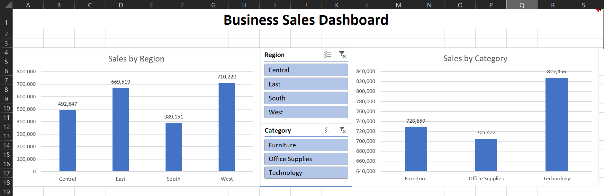

# FUTURE_DS_01
# Business Sales Performance Analysis

## 📊 Project Overview

This project analyzes business sales data to identify key insights such as revenue trends, top-performing regions, and product categories.

## 🛠 Tools Used

* Microsoft Excel
* Pivot Tables
* Data Visualization (Charts)

## 📁 Dataset

Superstore Sales Dataset (Kaggle)

## 📌 Key Insights

* West region generated the highest sales
* Technology is the top-performing category
* South region shows lower performance

## 📊 Dashboard Features

* Sales by Region
* Sales by Category
* Interactive slicers for filtering

## 🚀 Outcome

This project demonstrates practical skills in data analysis, visualization, and business insight generation.

## Dashboard Preview

## 🔗 Author

Shaik Meharunnisa
